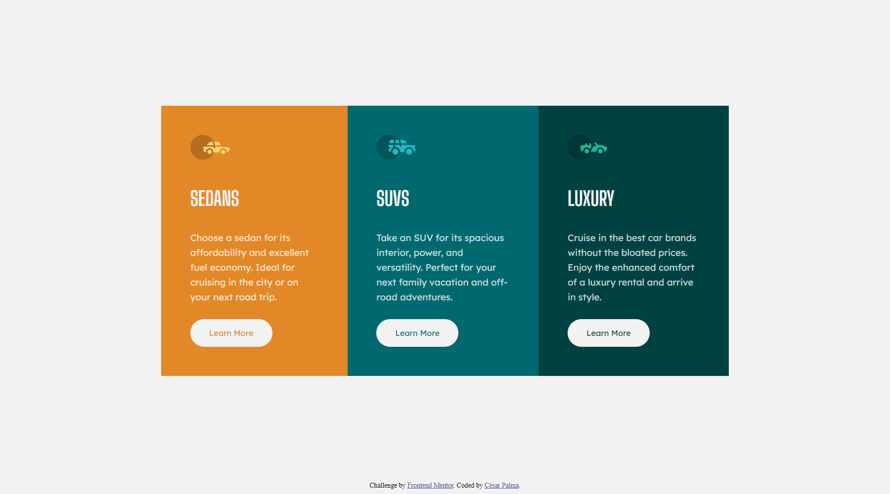

# Frontend Mentor - 3-column preview card component solution

This is a solution to the [3-column preview card component challenge on Frontend Mentor](https://www.frontendmentor.io/challenges/3column-preview-card-component-pH92eAR2-). Frontend Mentor challenges help you improve your coding skills by building realistic projects.

## Table of contents

- [Frontend Mentor - 3-column preview card component solution](#frontend-mentor---3-column-preview-card-component-solution)
  - [Table of contents](#table-of-contents)
  - [Overview](#overview)
    - [The challenge](#the-challenge)
    - [Screenshot](#screenshot)
    - [Links](#links)
  - [My process](#my-process)
    - [Built with](#built-with)
    - [What I learned](#what-i-learned)
    - [Useful resources](#useful-resources)
  - [Author](#author)

**Note: Delete this note and update the table of contents based on what sections you keep.**

## Overview

### The challenge

Users should be able to:

- View the optimal layout depending on their device's screen size
- See hover states for interactive elements

### Screenshot

### Links

- [Solution URL](https://github.com/xsrpm/standard-web-projects/tree/master/css/3-column-preview-card-component)
- [Live Site URL](https://xsrpm.github.io/standard-web-projects/css/3-column-preview-card-component/)

## My process

### Built with

- Semantic HTML5 markup
- CSS custom properties
- Flexbox
- CSS Grid
- Mobile-first workflow

### What I learned

- hover event when hovering over a button with border

### Useful resources

- https://stackoverflow.com/questions/20936625/how-to-remove-the-hover-background-color-from-a-specific-anchor-tag-with-bootstr
- https://developer.mozilla.org/en-US/docs/Web/CSS/border

## Author

- Website - [César Palma (XsrPm)](https://xsrpm.github.io)
- Frontend Mentor - [@xsrpm](https://www.frontendmentor.io/profile/xsrpm)
- Twitter - [@xsrpma](https://www.twitter.com/xsrpma)
