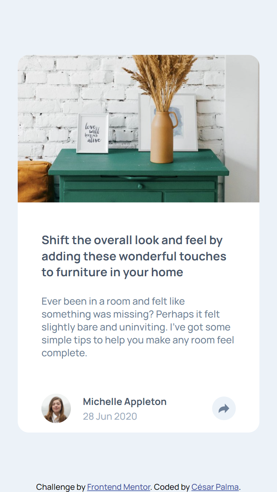
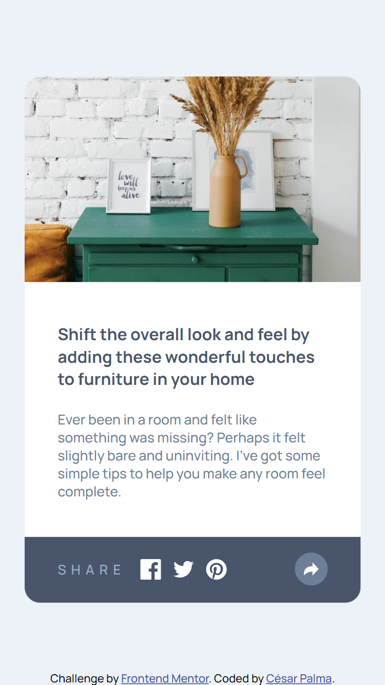
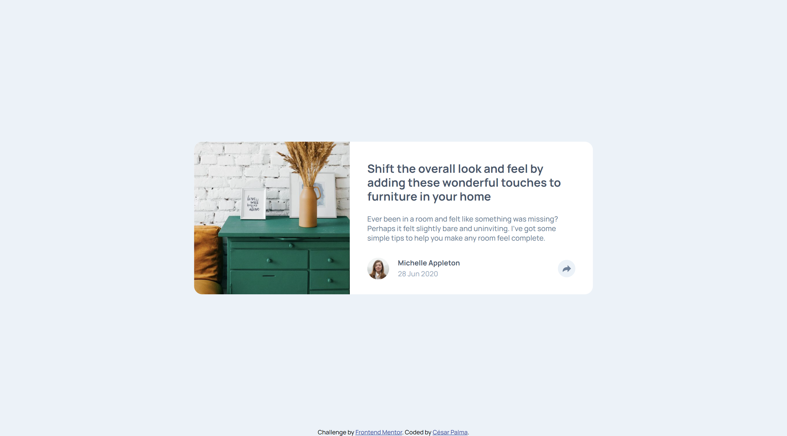
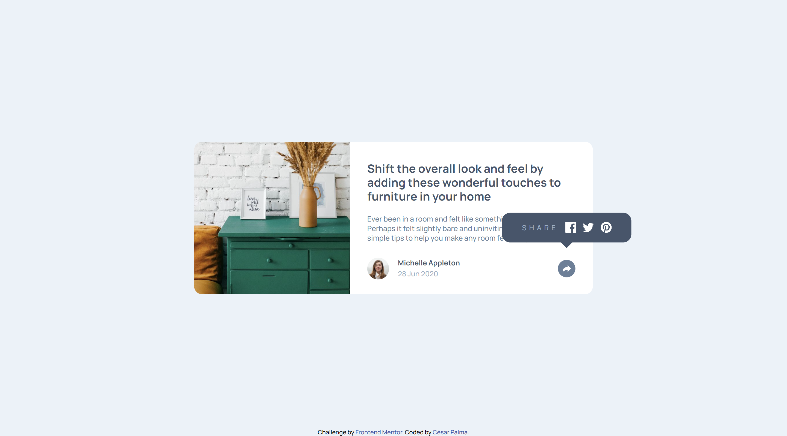

# Frontend Mentor - Article preview component solution

This is a solution to the [Article preview component challenge on Frontend Mentor](https://www.frontendmentor.io/challenges/article-preview-component-dYBN_pYFT). Frontend Mentor challenges help you improve your coding skills by building realistic projects.

## Table of contents

- [Frontend Mentor - Article preview component solution](#frontend-mentor---article-preview-component-solution)
  - [Table of contents](#table-of-contents)
  - [Overview](#overview)
    - [The challenge](#the-challenge)
    - [Screenshot](#screenshot)
    - [Links](#links)
  - [My process](#my-process)
    - [Built with](#built-with)
    - [What I learned](#what-i-learned)
    - [Useful resources](#useful-resources)
  - [Author](#author)
  - [Acknolegments](#acknolegments)

## Overview

### The challenge

Users should be able to:

- View the optimal layout for the component depending on their device's screen size
- See the social media share links when they click the share icon

### Screenshot

### Links

- [Solution URL](https://github.com/xsrpm/standard-web-projects/tree/master/css/article-preview-component)
- [Live Site URL](https://xsrpm.github.io/standard-web-projects/css/article-preview-component/)

## My process

### Built with

- Semantic HTML5 markup
- CSS custom properties
- Flexbox
- CSS Grid
- Mobile-first workflow
- CSS Position relative/absolute and z-index

### What I learned

- correctly use z-index for positioned elements.
- create more complex designs on different targets for active elements

### Useful resources

- https://stackoverflow.com/questions/22252472/how-to-change-the-color-of-an-svg-element#:~:text=You%20can't%20change%20the,or%20using%20inline.
- https://css-tricks.com/using-svg/
- https://developer.mozilla.org/en-US/docs/Web/CSS/z-index

## Author

- Website - [César Palma (XsrPm)](https://xsrpm.github.io)
- Frontend Mentor - [@xsrpm](https://www.frontendmentor.io/profile/xsrpm)
- Twitter - [@xsrpma](https://www.twitter.com/xsrpma)

## Acknolegments

- [Fluffy Kas](https://www.frontendmentor.io/profile/FluffyKas)
- [Vinay Puppal](https://www.frontendmentor.io/profile/vinaypuppal)
