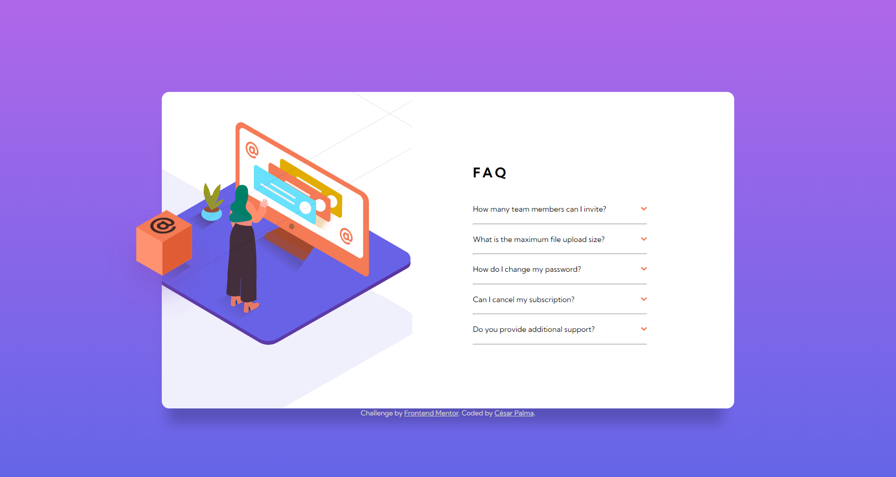
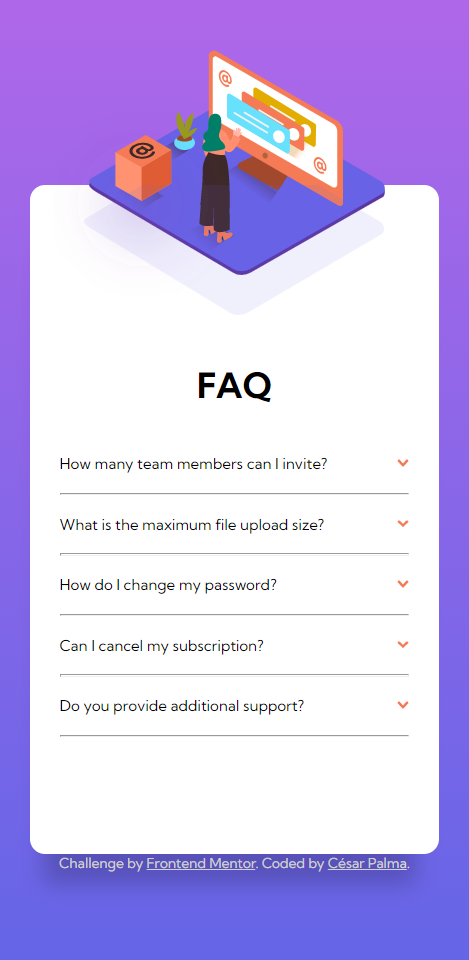

# Frontend Mentor - FAQ accordion card solution

This is a solution to the [FAQ accordion card challenge on Frontend Mentor](https://www.frontendmentor.io/challenges/faq-accordion-card-XlyjD0Oam). Frontend Mentor challenges help you improve your coding skills by building realistic projects.

## Table of contents

- [Frontend Mentor - FAQ accordion card solution](#frontend-mentor---faq-accordion-card-solution)
  - [Table of contents](#table-of-contents)
  - [Overview](#overview)
    - [The challenge](#the-challenge)
    - [Screenshot](#screenshot)
    - [Links](#links)
  - [My process](#my-process)
    - [Built with](#built-with)
    - [What I learned](#what-i-learned)
    - [Useful resources](#useful-resources)
  - [Author](#author)

**Note: Delete this note and update the table of contents based on what sections you keep.**

## Overview

### The challenge

Users should be able to:

- View the optimal layout for the component depending on their device's screen size
- See hover states for all interactive elements on the page
- Hide/Show the answer to a question when the question is clicked

### Screenshot

### Links

- [Solution URL](https://github.com/xsrpm/standard-web-projects/tree/master/css/faq-accordion-card)
- [Live Site URL](https://xsrpm.github.io/standard-web-projects/css/faq-accordion-card/)

## My process

### Built with

- Semantic HTML5 markup
- CSS custom properties
- CSS Flexbox
- CSS position relative/absolute
- CSS linear gradients
- CSS overflow hidden
- JS Vanilla
- Mobile-first workflow

### What I learned

- Move elements with relative and absolute position
- Make an accordion

### Useful resources

- https://es.stackoverflow.com/questions/37930/cual-es-la-diferencia-entre-position-relative-position-absolute-y-position

## Author

- Website - [César Palma (XsrPm)](https://xsrpm.github.io)
- Frontend Mentor - [@xsrpm](https://www.frontendmentor.io/profile/xsrpm)
- Twitter - [@xsrpma](https://www.twitter.com/xsrpma)
