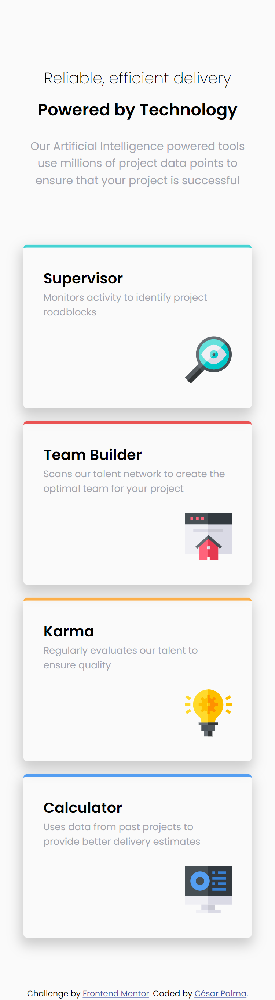
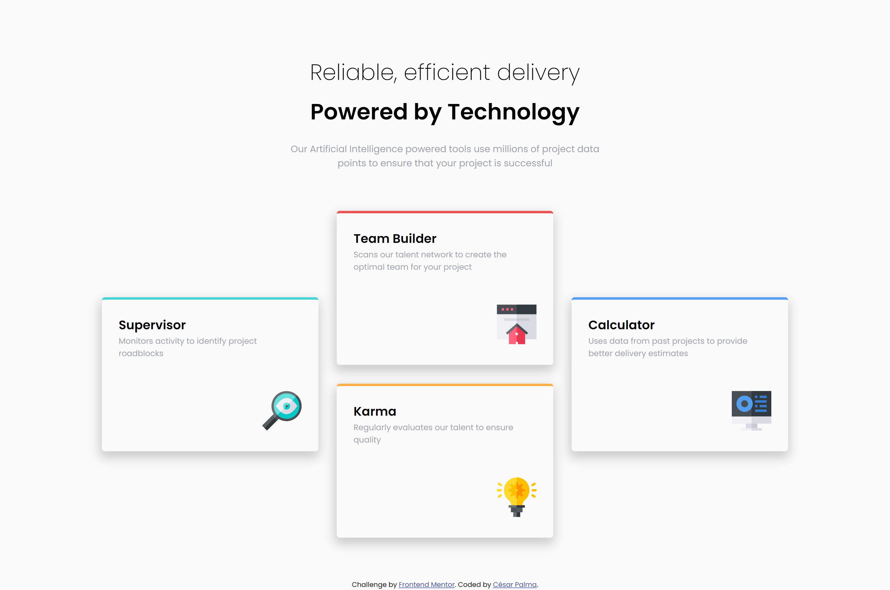

# Frontend Mentor - Four card feature section solution

This is a solution to the [Four card feature section challenge on Frontend Mentor](https://www.frontendmentor.io/challenges/four-card-feature-section-weK1eFYK). Frontend Mentor challenges help you improve your coding skills by building realistic projects.

## Table of contents

- [Frontend Mentor - Four card feature section solution](#frontend-mentor---four-card-feature-section-solution)
  - [Table of contents](#table-of-contents)
  - [Overview](#overview)
    - [The challenge](#the-challenge)
    - [Screenshot](#screenshot)
    - [Links](#links)
  - [My process](#my-process)
    - [Built with](#built-with)
    - [What I learned](#what-i-learned)
    - [Useful resources](#useful-resources)
  - [Author](#author)

## Overview

### The challenge

Users should be able to:

- View the optimal layout for the site depending on their device's screen size

### Screenshot

### Links

- [Solution URL](https://github.com/xsrpm/standard-web-projects/tree/master/css/four-card-feature-section)
- [Live Site URL](https://xsrpm.github.io/standard-web-projects/css/four-card-feature-section/)

## My process

### Built with

- Semantic HTML5 markup
- CSS custom properties
- Flexbox
- CSS Grid
- Mobile-first workflow

### What I learned

- improve my knowledge of css grid
- use less code for web responsive using max-width, min-width, min-height, max-height, height: auto, margin: 0 auto

### Useful resources

- [CSS:nth-of-type](https://developer.mozilla.org/es/docs/Web/CSS/:nth-of-type)
- [CSS:border-top](https://developer.mozilla.org/en-US/docs/Web/CSS/border-top)
- [HTML:picture](https://developer.mozilla.org/en-US/docs/Web/HTML/Element/picture)
- [CSS Box-shadow generator](https://cssgenerator.org/box-shadow-css-generator.html)

## Author

- Website - [César Palma (XsrPm)](https://xsrpm.github.io)
- Frontend Mentor - [@xsrpm](https://www.frontendmentor.io/profile/xsrpm)
- Twitter - [@xsrpma](https://www.twitter.com/xsrpma)
