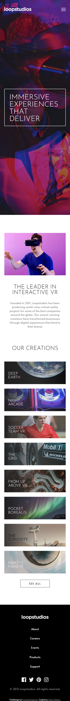

# Frontend Mentor - Loopstudios landing page solution

This is a solution to the [Loopstudios landing page challenge on Frontend Mentor](https://www.frontendmentor.io/challenges/loopstudios-landing-page-N88J5Onjw). Frontend Mentor challenges help you improve your coding skills by building realistic projects.

## Table of contents

- [Frontend Mentor - Loopstudios landing page solution](#frontend-mentor---loopstudios-landing-page-solution)
  - [Table of contents](#table-of-contents)
  - [Overview](#overview)
    - [The challenge](#the-challenge)
    - [Screenshot](#screenshot)
    - [Links](#links)
  - [My process](#my-process)
    - [Built with](#built-with)
    - [What I learned](#what-i-learned)
    - [Useful resources](#useful-resources)
  - [Author](#author)

## Overview

### The challenge

Users should be able to:

- View the optimal layout for the site depending on their device's screen size
- See hover states for all interactive elements on the page

### Screenshot

### Links

- Solution URL: [Add solution URL here](https://your-solution-url.com)
- Live Site URL: [Add live site URL here](https://your-live-site-url.com)

## My process

### Built with

- Semantic HTML5 markup
- CSS custom properties
- Flexbox
- CSS Grid
- Mobile-first workflow

### What I learned

- How to use css to change active state of background images.

### Useful resources

- [Stiling underlines web](https://css-tricks.com/styling-underlines-web/) - underline css guides.}
- [Clamp css guides](<https://developer.mozilla.org/en-US/docs/Web/CSS/clamp()>) - clamp css guides.
- [MDN Picture Element](https://developer.mozilla.org/en-US/docs/Web/HTML/Element/picture) - picture element
- [Underline css guide - StackOverflow](https://stackoverflow.com/questions/43085144/how-to-change-width-of-underline-in-css) - underline css guides
- [CSS Tricks - Mix Blend Mode](https://css-tricks.com/almanac/properties/m/mix-blend-mode/) - mix-blend-mode

## Author

- Website - [César Palma (XsrPm)](https://xsrpm.github.io)
- Frontend Mentor - [@xsrpm](https://www.frontendmentor.io/profile/xsrpm)
- Twitter - [@xsrpma](https://www.twitter.com/xsrpma)
