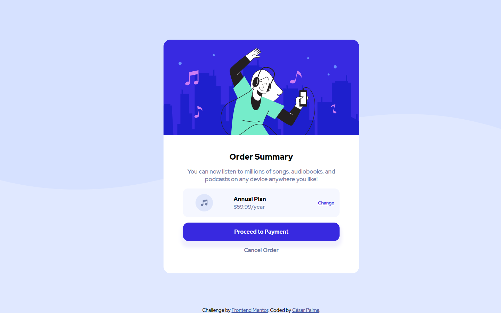

# Frontend Mentor - Order summary card solution

This is a solution to the [Order summary card challenge on Frontend Mentor](https://www.frontendmentor.io/challenges/order-summary-component-QlPmajDUj). Frontend Mentor challenges help you improve your coding skills by building realistic projects.

## Table of contents

- [Frontend Mentor - Order summary card solution](#frontend-mentor---order-summary-card-solution)
  - [Table of contents](#table-of-contents)
  - [Overview](#overview)
    - [The challenge](#the-challenge)
    - [Screenshot](#screenshot)
    - [Links](#links)
  - [My process](#my-process)
    - [Built with](#built-with)
    - [What I learned](#what-i-learned)
    - [Useful resources](#useful-resources)
  - [Author](#author)

## Overview

### The challenge

Users should be able to:

- See hover states for interactive elements

### Screenshot

### Links

- Solution URL: [Repository URL](https://github.com/xsrpm/standard-web-projects/tree/master/css/order-summary-component)
- Live Site URL: [Live Site URL](https://xsrpm.github.io/standard-web-projects/css/order-summary-component/)

## My process

### Built with

- Semantic HTML5 markup
- CSS custom properties
- Flexbox
- Mobile-first workflow

### What I learned

- CSS border-radius
- CCS object-fit to images in containers
- CSS custom properties
- CSS background-repeat

### Useful resources

- https://developer.mozilla.org/en-US/docs/Web/CSS/background-repeat
- https://developer.mozilla.org/en-US/docs/Web/CSS/:hover
- https://cssgenerator.org/box-shadow-css-generator.html
- https://developer.mozilla.org/en-US/docs/Web/CSS/box-shadow
- https://css-tricks.com/lodge/svg/06-using-svg-svg-background-image/
- https://developer.mozilla.org/en-US/docs/Web/CSS/object-fit
- https://ed.team/blog/hero-image-sin-photoshop-solo-css
- https://css3-tutorial.net/text-font/font-weight/
- https://developer.mozilla.org/en-US/docs/Web/CSS/font-weight
- https://www.w3schools.com/css/css3_borders.asp
- https://developer.mozilla.org/en-US/docs/Web/CSS/border-radius
- https://www.w3schools.com/cssref/pr_background-image.asp

## Author

- Website - [César Palma (XsrPm)](https://xsrpm.github.io)
- Frontend Mentor - [@xsrpm](https://www.frontendmentor.io/profile/xsrpm)
- Twitter - [@xsrpma](https://www.twitter.com/xsrpma)
