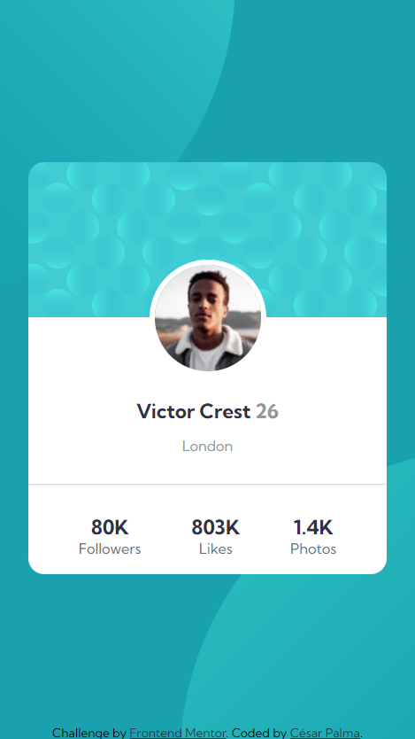

# Frontend Mentor - Profile card component solution

This is a solution to the [Profile card component challenge on Frontend Mentor](https://www.frontendmentor.io/challenges/profile-card-component-cfArpWshJ). Frontend Mentor challenges help you improve your coding skills by building realistic projects.

## Table of contents

- [Frontend Mentor - Profile card component solution](#frontend-mentor---profile-card-component-solution)
  - [Table of contents](#table-of-contents)
  - [Overview](#overview)
    - [The challenge](#the-challenge)
    - [Screenshot](#screenshot)
    - [Links](#links)
  - [My process](#my-process)
    - [Built with](#built-with)
    - [What I learned](#what-i-learned)
    - [Useful resources](#useful-resources)
  - [Author](#author)

**Note: Delete this note and update the table of contents based on what sections you keep.**

## Overview

### The challenge

- Build out the project to the designs provided

### Screenshot

### Links

- [Solution URL](https://github.com/xsrpm/standard-web-projects/tree/master/css/profile-card-component)
- [Live Site URL](https://xsrpm.github.io/standard-web-projects/css/profile-card-component/)

## My process

### Built with

- Semantic HTML5 markup
- CSS custom properties
- CSS background
- Flexbox
- Mobile-first workflow

### What I learned

- I learned to customize backgrounds in css with more than one svg image, position it in negative points to move it a little on the screen

### Useful resources

- https://www.w3schools.com/css/css3_backgrounds.asp
- https://developer.mozilla.org/en-US/docs/Web/CSS/CSS_Backgrounds_and_Borders/Using_multiple_backgrounds
- https://developer.mozilla.org/en-US/docs/Web/CSS/background
- https://developer.mozilla.org/en-US/docs/Web/CSS/background-position
- https://developer.mozilla.org/en-US/docs/Web/CSS/background-size
- https://css-tricks.com/css-basics-using-multiple-backgrounds/
- https://www.webucator.com/article/how-to-use-multiple-background-images-with-css/

## Author

- Website - [César Palma (XsrPm)](https://xsrpm.github.io)
- Frontend Mentor - [@xsrpm](https://www.frontendmentor.io/profile/xsrpm)
- Twitter - [@xsrpma](https://www.twitter.com/xsrpma)
