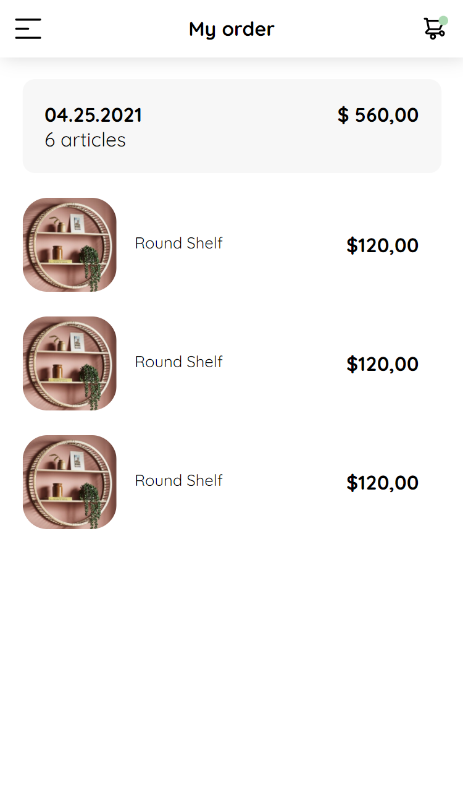

# Proyecto de maquetación desde figma a html/css

## Basado en el proyecto del Curso Practico de Frontend Developer (Platzi)

Profesora: Estefany Aguilar

https://scene.zeplin.io/project/60afeeed20af1378ed046538

Prototipo mobile
https://www.figma.com/proto/bcEVujIzJj5PNIWwF9pP2w/Platzi_YardSale?node-id=0%3A684&amp%3Bscaling=scale-down&amp%3Bpage-id=0%3A1&amp%3Bstarting-point-node-id=0%3A719

Prototipo desktop
https://www.figma.com/proto/bcEVujIzJj5PNIWwF9pP2w/Platzi_YardSale?node-id=3%3A2112&amp%3Bscaling=scale-down&amp%3Bpage-id=0%3A998&amp%3Bstarting-point-node-id=5%3A2808

## Referencia

https://css-tricks.com/css-content/
https://developer.mozilla.org/en-US/docs/Web/CSS/content
https://www.w3schools.com/cssref/pr_gen_content.asp
