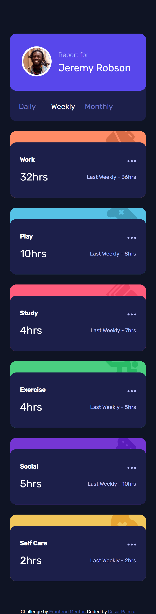

# Frontend Mentor - Time tracking dashboard solution

This is a solution to the [Time tracking dashboard challenge on Frontend Mentor](https://www.frontendmentor.io/challenges/time-tracking-dashboard-UIQ7167Jw). Frontend Mentor challenges help you improve your coding skills by building realistic projects.

## Table of contents

- [Frontend Mentor - Time tracking dashboard solution](#frontend-mentor---time-tracking-dashboard-solution)
  - [Table of contents](#table-of-contents)
  - [Overview](#overview)
    - [The challenge](#the-challenge)
    - [Screenshot](#screenshot)
    - [Links](#links)
  - [My process](#my-process)
    - [Built with](#built-with)
    - [What I learned](#what-i-learned)
    - [Useful resources](#useful-resources)
  - [Author](#author)

## Overview

### The challenge

Users should be able to:

- View the optimal layout for the site depending on their device's screen size
- See hover states for all interactive elements on the page
- Switch between viewing Daily, Weekly, and Monthly stats

### Screenshot

### Links

- Solution URL: [Add solution URL here](https://your-solution-url.com)
- Live Site URL: [Add live site URL here](https://your-live-site-url.com)

## My process

### Built with

- Semantic HTML5 markup
- CSS custom properties
- Flexbox
- CSS Grid
- Mobile-first workflow
- Javascript
- APIs WEB: fetch, DOM.

### What I learned

- use fetch() to fetch data from files
- integrate knowledge of CSS and Javascript

### Useful resources

- https://devcode.la/tutoriales/pseudoclases-css-first-child-last-child-nth-child/
- https://www.w3schools.com/graphics/svg_intro.asp
- https://www.w3schools.com/cssref/pr_background-position.asp
- https://developer.mozilla.org/en-US/docs/Web/CSS/background-position
- https://developer.mozilla.org/es/docs/Glossary/IIFE
- https://developer.mozilla.org/en-US/docs/Web/API/Node/appendChild
- https://developer.mozilla.org/en-US/docs/Web/JavaScript/Reference/Global_Objects/String/split
- https://www.geeksforgeeks.org/css-fill-property/

## Author

- Website - [César Palma (XsrPm)](https://xsrpm.github.io)
- Frontend Mentor - [@xsrpm](https://www.frontendmentor.io/profile/xsrpm)
- Twitter - [@xsrpma](https://www.twitter.com/xsrpma)
